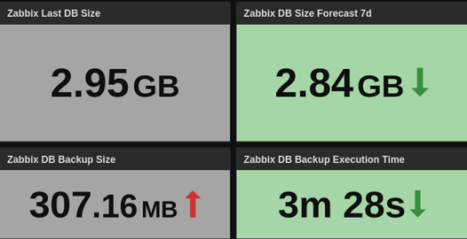

# Zabbix MySQL DB Backup Script and Template

<div align="right">

[](./LICENSE) [](./zabbix_db_bkp_full.sh) [](./zabbix_db_backup_stats_template_v722.yaml)

</div>

<BR>

## OVERVIEW

This is a script that creates a full backup of the Zabbix database. It is useful to automate Zabbix DB backups with a _crontab_ or some other tool like Zabbix itself, and keep the backups consistent. Along with it, a useful template that pulls the script log data into Zabbix.

The script uses `mysqldump` to produce a set of SQL statements from the Zabbix MySQL database for backup purposes. It also reduces the size of the database dump by compressing it with `gzip`. During this process, the script records the execution to a log file and writes some statistics.

The template is ready to read the script log statistics with a Zabbix Agent in active mode, and alert if the backup has failed.



<BR>

### Requirements

- [`mysqldump`](https://dev.mysql.com/doc/refman/9.0/en/mysqldump.html)
- [`gzip`](https://www.gnu.org/software/gzip/)
- A MySQL [backup user](https://www.zabbix.com/documentation/current/en/manual/appendix/install/db_scripts) for Zabbix database dump

> **If required, add the `RELOAD` and `PROCESS` database privileges to the backup user. For example:**
>
> ```sql
> GRANT RELOAD, PROCESS ON *.* TO 'backup_user'@'localhost';
> FLUSH PRIVILEGES;
> ```
>
> **or**
>
> ```sql
> GRANT SELECT, SHOW VIEW, LOCK TABLES, SHOW DATABASES, PROCESS, RELOAD, EVENT, TRIGGER
> ON `zabbixDB`.* TO 'backup_user'@'localhost';
> FLUSH PRIVILEGES;
> ```


<BR>

### Script Usage

**1.** Add execute permission to the script file after downloading it to the Zabbix server.

```
chmod +x zabbix_db_bkp_full.sh
```

**2.1** **[`OPTION 1`]** To use a pre-set Zabbix DB authentication, set the authentication values inside the script at step `#002.001` and pass the `-d` argument when executing it.

> ⚠️ **For this option, it is recommended to secure the script file permissions in the system (e.g. _user access only_).**

```
#002.001 VAR TEST
    dbhost="localhost"         # SET HERE YOUR PRE-SET DB HOSTNAME
    dbname="zabbix"            # SET HERE YOUR PRE-SET DB NAME
    dbuser="zabbix"            # SET HERE YOUR PRE-SET DB USERNAME
    dbpass="zabbix"            # SET HERE YOUR PRE-SET DB USERNAME'S PASSWORD
```
```
./zabbix_db_bkp_full.sh -d
```

---

**2.2** **[`OPTION 2`]** To use your Zabbix DB authentication as arguments, pass all arguments in the order below. Note that the dump may fail if any argument is out of order.

> ⚠️ **For this option, it is recommended to secure the authentication password in the operating system (e.g. _environment variables_).**

```
./zabbix_db_bkp_full.sh "[dbhost]" "[dbname]" "[dbuser]" "[dbpass]"
```

<BR>

#### Script Defaults

- The default backup directory is set to the user's home directory (`$HOME`) and is named `zabbix_db_bkp`. This can be changed in step `#002` by changing the `bkpdir` variable.
- The log file resides in the backup file directory within the `log` subdirectory.
- The default backup filename is set to `zabbix_db_bkp_full`. A timestamp prefix is appended to the file in the `yyyyMMddhhmmss` format followed by the `.sql.gz` file extension. For example `20250109040001_zabbix_db_bkp_full.sql.gz`.
- By default, the script only keeps **`30`** days of backup files and deletes any backups older than that. This can be changed in step `#002` by modifying the `bkpdays` variable.
- The script output is written both to the console and to the log file.

#### Log Sample

```
20250110173529 >> ------------------------------------------------
20250110173529 >> START
20250110173529 >> Dumping "zabbix" database
20250110173857 >> DB dump complete
20250110173857 >> Backup file: "/home/user/zabbix_db_bkp/20250110173529_zabbix_db_bkp_full.sql.gz"
20250110173857 >> Excluding old backup with more than 30 days
20250110173857 >> Backup file size: 322082821B - 307MB
20250110173857 >> Backup total time: 208s - 00h03m28s
20250110173857 >> Backup stats: {"dump_state":0,"size":322082821,"time":208}
20250110173857 >> FINISH
```

<BR>

---
### ➡️ [Download Script](./zabbix_db_bkp_full.sh)
---
### ➡️ [Download Template](./zabbix_db_backup_stats_template_v722.yaml)
---
#### ➡️ [*How to import templates*](https://www.zabbix.com/documentation/current/en/manual/xml_export_import/templates#importing)
---

<BR>

## MACROS

| Macro                    | Default Value                       | Description |
| :----------------------- | :---------------------------------: | :---------- |
| `{$ZABBIX.BKP.LOG.DIR}`  |                                     | Full path to the backup log file |

<BR>

## ITEMS

| Name                                      | Description |
| :---------------------------------------- | :---------- |
| DB Backup Log Stats                       | Master item that pull the DB backup log messages |
| DB Backup Log Stats: DB Backup Dump State | DB backup dump state |
| DB Backup Log Stats: DB Backup Size       | DB backup file size in Bytes |
| DB Backup Log Stats: DB Backup Time       | DB backup execution time in seconds |

<BR>

## TRIGGERS

| Name                    | Description |
| :---------------------- | :---------- |
| Zabbix DB Backup Failed | The last Zabbix DB backup has failed |

<BR>

| [⬆️ Top](#zabbix-mysql-db-backup-script-and-template) |
| --- |
